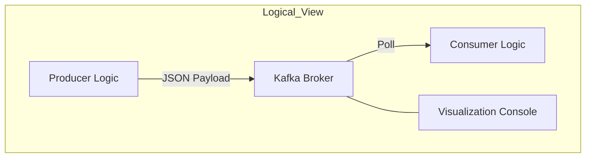
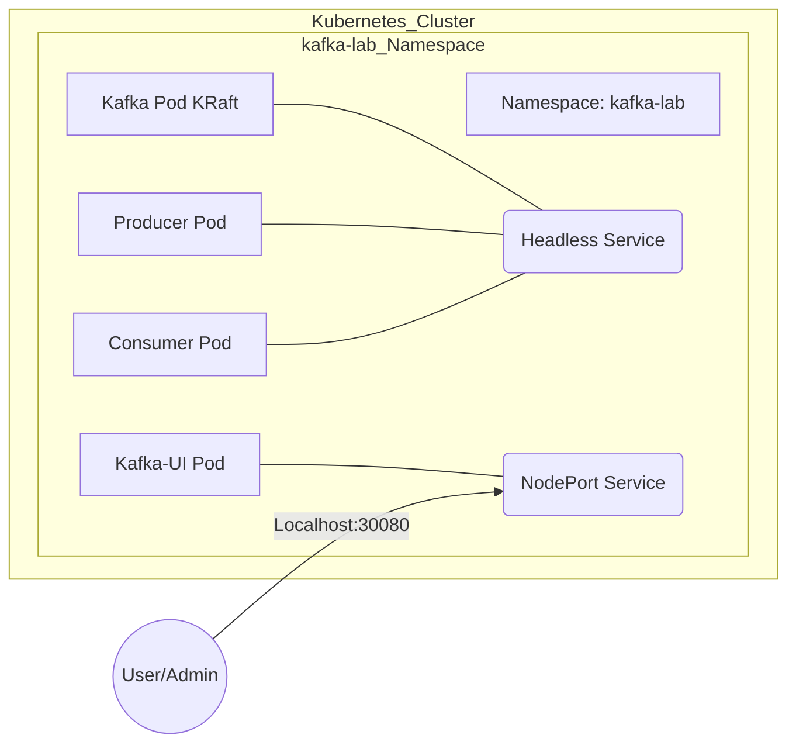
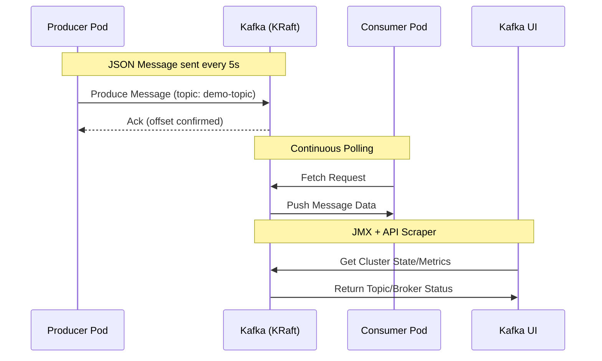

# Architecture Documentation: Kafka Kubernetes POC

This document provides a comprehensive architectural overview of the Kafka Kubernetes Lab, structured according to **ISO 42010** (Architecture Description), **Arcadia Methodology**, **ISO 15288** (System Life Cycle), and **ISO 330xx** (Process Assessment).

---

## 1. Architecture Description (ISO 42010)

This section defines the architecture through specific viewpoints relevant to stakeholders.

### 1.1 Stakeholders & Concerns
| Stakeholder | Primary Concerns |
| :--- | :--- |
| **Platform Ops / SysAdmin** | Scalability, KRaft Stability, Infrastructure Automation, Observability. |
| **Application Developer** | Connectivity, Topic Configuration, Producer/Consumer performance. |
| **Security Officer** | Namespace isolation, Internal communication security (PLAINTEXT in POC). |

### 1.2 Architecture Viewpoints
1.  **Structural View**: How Kubernetes resources are organized.
2.  **Behavioral View**: How data flows from Producer to Consumer via Kafka.
3.  **Governance View**: The Shared Responsibility model between Ops and Dev.

---

## 2. System Life Cycle (ISO 15288)

The project follows a streamlined life cycle for a Proof of Concept (POC).

### 2.1 Concept Stage
*   **Purpose**: Demonstrate a ZooKeeper-less Kafka (KRaft) deployment on Kubernetes.
*   **Requirements**: Local execution on Docker Desktop, automated deployment via PowerShell/Bash.

### 2.2 Development Stage
*   **Implementation**: Custom Python images for Producer and Consumer to ensure log visibility (`PYTHONUNBUFFERED=1`).
*   **Infrastructure**: Kubernetes YAML manifests for Namespaces, Services, and Deployments.

### 2.3 Utilization Stage
*   **Operation**: Running `start-lab.ps1` to provision the environment.
*   **Validation**: Monitoring logs and Kafka UI (port 30080) to confirm message delivery.

---

## 3. Arcadia Methodology Analysis

Arcadia provides a top-down approach from operational needs to physical implementation.

### 3.1 Operational Analysis (OA)
Identifying the "Who" and "Why".
*   **Operational Entity**: Platform Engineering Team.
*   **Operational Task**: Provide a self-service event-streaming platform for development teams.

### 3.2 System Analysis (SA)
Defining the "What".
*   **System Boundary**: The `kafka-lab` namespace.
*   **Key Functions**: Message persistence, Topic initialization, JMX metrics export.

### 3.3 Logical Architecture (LA)
The functional breakdown.

### 3.4 Physical Architecture (PA)
The concrete realization in Kubernetes.

---

## 4. Behavioral Flow

---

## 5. Process Maturity (ISO 330xx)

Assessment of the current project maturity level.

| Process Area | Maturity Level | Evidence |
| :--- | :--- | :--- |
| **Provisioning** | Level 3 (Defined) | Automated via `start-lab.ps1` and YAML manifests. |
| **Application Logic** | Level 4 (Predictable) | Consistent JSON schema and delivery report confirmation. |
| **Governance** | Level 2 (Managed) | Clearly defined Shared Responsibility model in README. |
| **Observability** | Level 3 (Defined) | Integrated UI with JMX metrics and unbuffered logs. |

*Maturity Key: 1 (Performed), 2 (Managed), 3 (Defined), 4 (Predictable), 5 (Optimizing)*

---

## 6. Conclusion
The architecture follows modern distributed system patterns, leveraging KRaft for simplicity and Arcadia methodology for comprehensive stakeholder mapping. The project is currently at a **Level 3 (Defined)** maturity for local POC environments.
