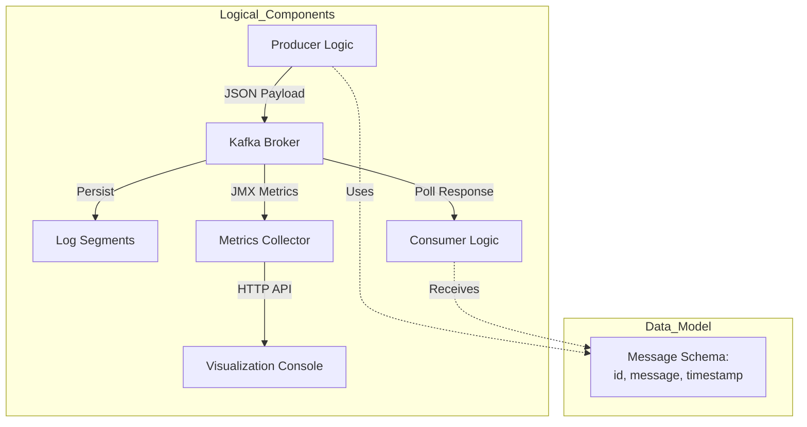
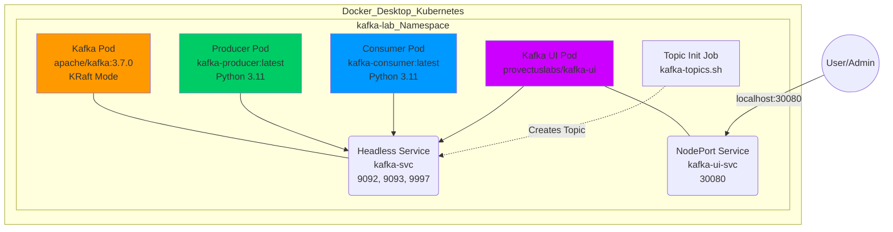
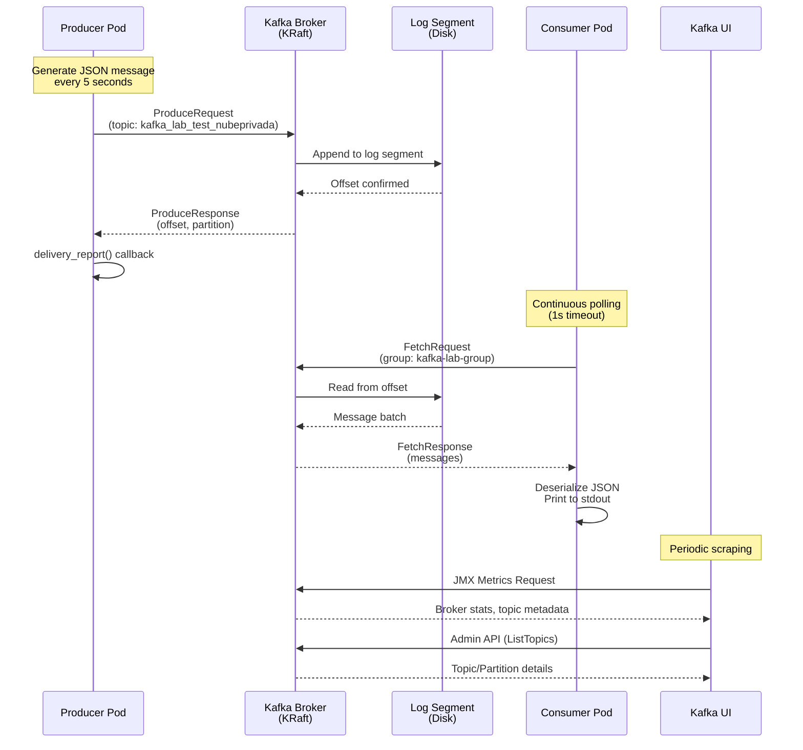

# Architecture Documentation: Kafka Kubernetes POC

## Executive Overview

This document provides a comprehensive architectural description of a **Kafka on Kubernetes Proof of Concept (POC)** deployment, designed to demonstrate event-driven messaging in a cloud-native environment. The system leverages **Apache Kafka 3.7.0** running in **KRaft mode** (ZooKeeper-less) on a local Kubernetes cluster (Docker Desktop), with Python-based producer and consumer applications demonstrating end-to-end message flow.

**Key Objectives:**
- Demonstrate a production-ready Kafka deployment pattern using KRaft consensus protocol
- Provide a reproducible local development environment for event-streaming applications
- Establish Infrastructure as Code (IaC) principles for Kafka cluster provisioning
- Implement observability through JMX metrics and web-based UI console
- Showcase the Shared Responsibility Model between Platform Operations and Application Development teams

**Target Audience:** Platform Engineers, SysAdmins, Application Developers, and Solution Architects evaluating Kafka for event-driven architectures.

---

## 1. Architecture Description (ISO 42010)

This section defines the architecture through specific viewpoints relevant to stakeholders, following the **ISO/IEC/IEEE 42010:2011** standard for architecture description.

### 1.1 Stakeholders & Concerns

| Stakeholder | Primary Concerns |
| :--- | :--- |
| **Platform Operations / SysAdmin** | Cluster stability, resource allocation, KRaft mode reliability, automation, observability, disaster recovery. |
| **Application Developer** | Topic connectivity, message delivery guarantees, consumer group management, schema evolution, development velocity. |
| **Security Officer** | Network isolation (namespace boundaries), authentication mechanisms (PLAINTEXT in POC, TLS/SASL in production), data encryption at rest and in transit. |
| **Solution Architect** | Scalability patterns, integration points, technology stack alignment, compliance with enterprise standards. |

### 1.2 Architecture Viewpoints

#### 1.2.1 Structural View
Defines how Kubernetes resources are organized and deployed.

**Namespace Isolation:**
- All components reside in the `kafka-lab` namespace for logical separation and resource governance.

**Service Topology:**
- **Headless Service** (`kafka-svc`): Provides stable DNS for Kafka broker discovery without load balancing.
- **NodePort Service** (`kafka-ui-svc`): Exposes Kafka UI on port 30080 for external access.

**Deployment Strategy:**
- Single-replica Kafka broker (POC configuration; production would use StatefulSet with multiple replicas).
- Deployment-based producer and consumer for stateless application patterns.

#### 1.2.2 Behavioral View
Describes how data flows from Producer to Consumer via Kafka topics.

**Message Flow:**
1. Producer generates JSON payloads every 5 seconds
2. Messages are published to topic `kafka_lab_test_nubeprivada`
3. Kafka broker persists messages and acknowledges receipt
4. Consumer polls the topic and processes messages
5. Kafka UI provides real-time visualization of cluster state

#### 1.2.3 Governance View
Defines the **Shared Responsibility Model** between Operations and Development teams.

| Responsibility Domain | Platform Operations | Application Development |
| :--- | :--- | :--- |
| **Infrastructure Provisioning** | Kubernetes manifests, Kafka broker configuration, resource limits | N/A |
| **Topic Management** | Define guardrails (max partitions, retention policies) | Create topics via IaC or API within guardrails |
| **Security** | TLS/SASL configuration, network policies, IAM integration | Define ACLs for specific topics and consumer groups |
| **Performance Tuning** | Broker-level settings (log segment size, compression), OS tuning | Producer batching, consumer fetch sizes, offset management |
| **Monitoring & Alerting** | JMX metrics collection, cluster health dashboards | Application-level metrics (lag, throughput) |

---

## 2. System Life Cycle (ISO 15288)

The project follows the **ISO/IEC/IEEE 15288:2015** Systems and Software Engineering life cycle processes.

### 2.1 Concept Stage

**Purpose:**  
Demonstrate a ZooKeeper-less Kafka deployment using the KRaft consensus protocol, eliminating the operational complexity of managing a separate ZooKeeper ensemble.

**Stakeholder Requirements:**
- Local execution on Docker Desktop for Kubernetes
- Automated provisioning via PowerShell scripts
- Minimal manual intervention for setup and teardown
- Visual confirmation of message flow through UI console

**System Requirements:**
- Kafka broker running in combined broker+controller mode
- Topic with configurable partitions and replication factor
- Producer and consumer applications with visible logging
- JMX metrics exposure for observability

### 2.2 Development Stage

**Implementation Decisions:**

1. **KRaft Mode Selection:**  
   - Eliminates ZooKeeper dependency, reducing operational overhead
   - Single-node KRaft configuration suitable for POC (production requires 3+ controller nodes)
   - Cluster ID: `L629Z6wRRE67O_bI5q3WvA` (pre-generated for consistency)

2. **Python Application Design:**
   - `PYTHONUNBUFFERED=1` environment variable ensures real-time log visibility
   - `flush=True` in print statements for immediate stdout output
   - `confluent_kafka` library for robust Kafka client implementation

3. **Infrastructure as Code:**
   - Kubernetes YAML manifests for declarative resource management
   - Namespace isolation (`kafka-lab`) for multi-tenancy simulation
   - PowerShell automation script (`start-lab.ps1`) for Windows environments

4. **Observability:**
   - JMX metrics on port 9997 for broker monitoring
   - Kafka UI (port 30080) for visual cluster inspection
   - Unbuffered application logs for real-time debugging

### 2.3 Utilization Stage

**Operational Procedures:**

1. **Provisioning:**  
   Execute `start-lab.ps1` to deploy namespace, Kafka broker, topic initialization job, and applications.

2. **Validation:**  
   - Access Kafka UI at `http://localhost:30080`
   - Inspect producer logs: `kubectl logs -n kafka-lab deployment/kafka-producer -f`
   - Inspect consumer logs: `kubectl logs -n kafka-lab deployment/kafka-consumer -f`
   - Verify message delivery through UI topic browser

3. **Monitoring:**  
   - JMX metrics available for Prometheus scraping
   - Kafka UI provides broker health, topic lag, and partition distribution

4. **Decommissioning:**  
   Execute cleanup scripts to remove all resources and reclaim cluster capacity.

---

## 3. Arcadia Methodology Analysis

Arcadia provides a model-based systems engineering approach with four architectural layers, from operational needs to physical implementation.

### 3.1 Operational Analysis (OA)

**Operational Entities:**  
- **Platform Engineering Team**: Responsible for Kafka cluster lifecycle management
- **Application Development Teams**: Consume event-streaming services for microservices communication

**Operational Activities:**
- Provide self-service event-streaming platform
- Enable asynchronous communication between microservices
- Support event sourcing and CQRS patterns
- Facilitate real-time data pipelines

**Operational Capabilities:**
- Message persistence with configurable retention
- Horizontal scalability through topic partitioning
- Consumer group coordination for load balancing
- Exactly-once semantics (when configured with idempotent producers and transactional consumers)

### 3.2 System Analysis (SA)

**System Boundary:**  
The `kafka-lab` namespace defines the logical boundary of the system.

**System Functions:**
1. **Message Ingestion**: Accept messages from producers via Kafka protocol
2. **Message Persistence**: Store messages in append-only log segments
3. **Message Delivery**: Serve messages to consumers based on offset positions
4. **Topic Management**: Initialize and configure topics with partition/replication settings
5. **Metrics Export**: Expose JMX metrics for monitoring systems
6. **Cluster Visualization**: Provide web-based UI for operational insights

**External Interfaces:**
- **Producer Interface**: Kafka protocol on port 9092 (PLAINTEXT)
- **Controller Interface**: KRaft consensus on port 9093 (internal)
- **JMX Interface**: Metrics on port 9997
- **UI Interface**: HTTP on port 8080 (exposed as NodePort 30080)

### 3.3 Logical Architecture (LA)

The functional breakdown of the system components and their interactions.



**Component Responsibilities:**

- **Producer Logic**: Generate timestamped JSON messages, handle delivery acknowledgments
- **Kafka Broker**: Coordinate message persistence, manage consumer offsets, serve fetch requests
- **Log Segments**: Immutable append-only files storing message batches
- **Consumer Logic**: Poll for new messages, deserialize JSON, process business logic
- **Metrics Collector**: Aggregate JMX metrics from broker
- **Visualization Console**: Render cluster topology, topic metadata, and consumer lag

### 3.4 Physical Architecture (PA)

The concrete realization in Kubernetes infrastructure.



**Physical Deployment Details:**

| Component | Image | Replicas | Resource Limits | Ports |
| :--- | :--- | :--- | :--- | :--- |
| Kafka Broker | apache/kafka:3.7.0 | 1 | 1024Mi / 500m CPU | 9092, 9093, 9997 |
| Producer | kafka-producer:latest | 1 | (default) | N/A |
| Consumer | kafka-consumer:latest | 1 | (default) | N/A |
| Kafka UI | provectuslabs/kafka-ui | 1 | (default) | 8080 |

---

## 4. System Components

### 4.1 Kafka Broker (KRaft Mode)

**Configuration Details:**

```yaml
Environment Variables:
  KAFKA_NODE_ID: "1"
  KAFKA_PROCESS_ROLES: "broker,controller"
  KAFKA_CONTROLLER_LISTENER_NAMES: "CONTROLLER"
  KAFKA_LISTENERS: "PLAINTEXT://:9092,CONTROLLER://:9093"
  KAFKA_LISTENER_SECURITY_PROTOCOL_MAP: "CONTROLLER:PLAINTEXT,PLAINTEXT:PLAINTEXT"
  KAFKA_ADVERTISED_LISTENERS: "PLAINTEXT://kafka-svc.kafka-lab.svc.cluster.local:9092"
  KAFKA_CONTROLLER_QUORUM_VOTERS: "1@127.0.0.1:9093"
  CLUSTER_ID: "L629Z6wRRE67O_bI5q3WvA"
  KAFKA_OFFSETS_TOPIC_REPLICATION_FACTOR: "1"
  KAFKA_TRANSACTION_STATE_LOG_REPLICATION_FACTOR: "1"
  KAFKA_TRANSACTION_STATE_LOG_MIN_ISR: "1"
```

**Key Technical Decisions:**

- **Combined Broker+Controller Role**: Single process handles both data plane (broker) and control plane (controller) responsibilities
- **Replication Factor 1**: Suitable for POC; production requires RF ≥ 3 for fault tolerance
- **Min ISR 1**: Allows writes with single replica; production should use min.insync.replicas ≥ 2
- **PLAINTEXT Protocol**: No encryption for local development; production requires TLS/SASL

**JMX Metrics Configuration:**

```yaml
KAFKA_JMX_PORT: "9997"
KAFKA_JMX_OPTS: >
  -Dcom.sun.management.jmxremote
  -Dcom.sun.management.jmxremote.authenticate=false
  -Dcom.sun.management.jmxremote.ssl=false
  -Djava.rmi.server.hostname=kafka-svc.kafka-lab.svc.cluster.local
  -Dcom.sun.management.jmxremote.rmi.port=9997
```

### 4.2 Producer Application

**Implementation:** `03-producer/app.py`

**Kafka Client Configuration:**

```python
conf = {
    'bootstrap.servers': 'kafka-svc.kafka-lab.svc.cluster.local:9092',
    'client.id': socket.gethostname()
}
```

**Message Schema:**

```json
{
  "id": <integer>,
  "message": "Test message <id> from producer",
  "timestamp": <unix_timestamp>
}
```

**Producer Behavior:**

- **Message Frequency**: 5-second interval between messages
- **Delivery Guarantee**: Synchronous flush after each produce (ensures acknowledgment before proceeding)
- **Callback Mechanism**: `delivery_report()` function confirms successful delivery or reports errors
- **Key Strategy**: Uses message ID as partition key for deterministic partition assignment

**Technical Properties:**

| Property | Value | Rationale |
| :--- | :--- | :--- |
| `bootstrap.servers` | kafka-svc.kafka-lab.svc.cluster.local:9092 | Kubernetes DNS for service discovery |
| `client.id` | Pod hostname | Enables producer identification in broker logs |
| `acks` | (default: all) | Waits for all in-sync replicas (in this case, 1) |
| `retries` | (default: MAX_INT) | Automatic retry for transient failures |

### 4.3 Consumer Application

**Implementation:** `04-consumer/app.py`

**Kafka Client Configuration:**

```python
conf = {
    'bootstrap.servers': 'kafka-svc.kafka-lab.svc.cluster.local:9092',
    'group.id': 'kafka-lab-group',
    'auto.offset.reset': 'earliest'
}
```

**Consumer Behavior:**

- **Polling Strategy**: 1-second timeout on each poll() call
- **Offset Management**: Automatic commit (default behavior)
- **Error Handling**: Gracefully handles `_PARTITION_EOF` and transient errors
- **Deserialization**: UTF-8 decoding of message values

**Technical Properties:**

| Property | Value | Rationale |
| :--- | :--- | :--- |
| `group.id` | kafka-lab-group | Enables consumer group coordination and offset tracking |
| `auto.offset.reset` | earliest | Reads from beginning of topic on first connection |
| `enable.auto.commit` | (default: true) | Automatically commits offsets every 5 seconds |
| `auto.commit.interval.ms` | (default: 5000) | Frequency of offset commits |

### 4.4 Topic Configuration

**Topic Name:** `kafka_lab_test_nubeprivada`

**Initialization:** Kubernetes Job using `kafka-topics.sh`

```bash
kafka-topics.sh \
  --create \
  --if-not-exists \
  --topic kafka_lab_test_nubeprivada \
  --bootstrap-server kafka-svc.kafka-lab.svc.cluster.local:9092 \
  --partitions 1 \
  --replication-factor 1
```

**Topic Properties:**

| Property | Value | Production Recommendation |
| :--- | :--- | :--- |
| Partitions | 1 | Scale based on throughput (e.g., 3-12 partitions) |
| Replication Factor | 1 | Minimum 3 for fault tolerance |
| Retention | (default: 7 days) | Configure based on use case (hours to months) |
| Compression | (default: producer) | Use `lz4` or `zstd` for efficiency |

---

## 5. Infrastructure

### 5.1 Kubernetes Resources

**Namespace:**

```yaml
apiVersion: v1
kind: Namespace
metadata:
  name: kafka-lab
```

**Headless Service (Kafka):**

```yaml
apiVersion: v1
kind: Service
metadata:
  name: kafka-svc
  namespace: kafka-lab
spec:
  clusterIP: None  # Headless for stable DNS
  ports:
    - port: 9092
      name: inner
    - port: 9093
      name: controller
    - port: 9997
      name: jmx
  selector:
    app: kafka
```

**NodePort Service (Kafka UI):**

```yaml
apiVersion: v1
kind: Service
metadata:
  name: kafka-ui-svc
  namespace: kafka-lab
spec:
  type: NodePort
  ports:
    - port: 8080
      targetPort: 8080
      nodePort: 30080
  selector:
    app: kafka-ui
```

### 5.2 Docker Images

**Producer Dockerfile:**

```dockerfile
FROM python:3.11-slim
WORKDIR /app
RUN pip install confluent-kafka
COPY app.py .
ENV PYTHONUNBUFFERED=1
CMD ["python", "app.py"]
```

**Consumer Dockerfile:**

```dockerfile
FROM python:3.11-slim
WORKDIR /app
RUN pip install confluent-kafka
COPY app.py .
ENV PYTHONUNBUFFERED=1
CMD ["python", "app.py"]
```

**Key Design Choice:**  
`PYTHONUNBUFFERED=1` ensures that Python does not buffer stdout/stderr, making logs immediately visible in `kubectl logs` output.

### 5.3 Automation

**PowerShell Deployment Script:** `start-lab.ps1`

```powershell
# Phase 1: Namespace
kubectl apply -f 01-prep/namespace.yaml

# Phase 2: Kafka Broker
kubectl apply -f 02-kafka/kafka-kraft.yaml
kubectl wait --for=condition=ready pod -l app=kafka -n kafka-lab --timeout=120s

# Phase 3: Topic Initialization
kubectl apply -f 02-kafka/topic-init.yaml
kubectl wait --for=condition=complete job/create-topic -n kafka-lab --timeout=60s

# Phase 4: Applications
docker build -t kafka-producer:latest 03-producer
docker build -t kafka-consumer:latest 04-consumer
kubectl apply -f 04-consumer/deployments.yaml

# Phase 5: Kafka UI
kubectl apply -f 02-kafka/kafka-ui.yaml
```

---

## 6. Data Flow

### 6.1 Message Lifecycle



### 6.2 Step-by-Step Message Path

1. **Message Generation (Producer)**  
   - Producer constructs JSON payload with `id`, `message`, and `timestamp`
   - Calls `producer.produce()` with topic name and message key

2. **Network Transmission**  
   - Message sent via Kafka protocol to `kafka-svc.kafka-lab.svc.cluster.local:9092`
   - Kubernetes DNS resolves to Kafka pod IP

3. **Broker Reception**  
   - Kafka broker receives ProduceRequest
   - Validates topic existence and partition assignment

4. **Persistence**  
   - Message appended to active log segment on disk
   - Offset assigned and indexed

5. **Acknowledgment**  
   - Broker sends ProduceResponse with offset and partition
   - Producer's `delivery_report()` callback invoked

6. **Consumer Polling**  
   - Consumer sends FetchRequest with current offset
   - Broker reads from log segment and returns message batch

7. **Message Processing**  
   - Consumer deserializes JSON payload
   - Prints message to stdout (visible in pod logs)
   - Offset automatically committed after processing

8. **Observability**  
   - Kafka UI queries JMX metrics and Admin API
   - Displays real-time topic lag, partition distribution, and broker health

---

## 7. Technical Decisions

### 7.1 Why KRaft Mode?

**Decision:** Use Kafka in KRaft mode instead of traditional ZooKeeper-based deployment.

**Rationale:**
- **Simplified Operations**: Eliminates need to manage separate ZooKeeper ensemble (3-5 additional nodes in production)
- **Reduced Latency**: Metadata operations are faster with native Raft consensus
- **Future-Proofing**: ZooKeeper support deprecated in Kafka 3.x, removed in 4.0
- **Resource Efficiency**: Single-process deployment suitable for POC environments

**Trade-offs:**
- KRaft is production-ready as of Kafka 3.3, but some advanced features (e.g., JBOD) are still maturing
- Requires cluster ID pre-generation (`kafka-storage.sh random-uuid`)

### 7.2 Why Python Unbuffered Logging?

**Decision:** Set `PYTHONUNBUFFERED=1` and use `flush=True` in print statements.

**Rationale:**
- **Real-Time Debugging**: Logs appear immediately in `kubectl logs` output
- **Troubleshooting**: Critical for diagnosing connection issues during development
- **Observability**: Enables live monitoring of message flow without log aggregation tools

**Trade-offs:**
- Slight performance overhead from frequent I/O operations (negligible in POC)

### 7.3 Why Headless Service?

**Decision:** Use `clusterIP: None` for Kafka service.

**Rationale:**
- **Stable DNS**: Each Kafka pod gets a predictable DNS name (e.g., `kafka-0.kafka-svc.kafka-lab.svc.cluster.local`)
- **StatefulSet Compatibility**: Required for multi-broker deployments with persistent storage
- **KRaft Requirements**: Controller quorum voters need stable network identities

**Trade-offs:**
- Clients must handle broker discovery (handled by Kafka client libraries)

### 7.4 Why Single Partition/Replica?

**Decision:** Configure topic with 1 partition and replication factor 1.

**Rationale:**
- **POC Simplicity**: Minimizes resource usage on local Docker Desktop
- **Learning Focus**: Demonstrates core concepts without operational complexity
- **Fast Iteration**: Quick setup/teardown cycles for experimentation

**Production Guidance:**
- Use 3+ partitions for parallelism (matches consumer group size)
- Set replication factor ≥ 3 for fault tolerance
- Configure `min.insync.replicas=2` for durability

### 7.5 Why Shared Responsibility Model?

**Decision:** Document clear boundaries between Platform Ops and Application Dev.

**Rationale:**
- **Prevents Bottlenecks**: Developers can self-service topic creation within guardrails
- **Maintains Stability**: Ops retains control over cluster-level settings (retention, quotas)
- **Scales with Organization**: Enables multiple teams to use Kafka without central coordination

**Implementation:**
- Ops provides Terraform modules or Kubernetes Operators (e.g., Strimzi)
- Devs submit YAML manifests via GitOps (validated by CI/CD)
- Automated policy enforcement (e.g., max 100 partitions per topic)

---

## 8. Process Maturity (ISO 330xx)

Assessment of the current project maturity level according to **ISO/IEC 33002** process assessment model.

| Process Area | Maturity Level | Evidence | Improvement Path |
| :--- | :--- | :--- | :--- |
| **Provisioning** | Level 3 (Defined) | Automated via `start-lab.ps1` and declarative YAML manifests. | Level 4: Add Terraform for multi-environment deployment |
| **Application Logic** | Level 4 (Predictable) | Consistent JSON schema, delivery confirmation, error handling. | Level 5: Add schema registry (Avro/Protobuf) |
| **Governance** | Level 2 (Managed) | Documented Shared Responsibility model in README. | Level 3: Implement policy-as-code (OPA/Kyverno) |
| **Observability** | Level 3 (Defined) | Integrated UI, JMX metrics, unbuffered logs. | Level 4: Add Prometheus/Grafana dashboards |
| **Security** | Level 1 (Performed) | PLAINTEXT protocol, no authentication. | Level 3: Implement TLS, SASL/SCRAM, network policies |
| **Testing** | Level 2 (Managed) | Manual verification via logs and UI. | Level 3: Automated integration tests (Testcontainers) |

**Maturity Levels:**
1. **Performed**: Process achieves its purpose
2. **Managed**: Process is planned and tracked
3. **Defined**: Process uses defined/documented procedures
4. **Predictable**: Process operates within defined limits
5. **Optimizing**: Process is continuously improved

**Overall Assessment:**  
The POC demonstrates **Level 3 (Defined)** maturity for local development environments. Production readiness requires advancement to Level 4 in security, observability, and governance domains.

---

## 9. Conclusion

This architecture demonstrates a modern, cloud-native approach to event-driven messaging using Apache Kafka on Kubernetes. By leveraging **KRaft mode**, the system eliminates ZooKeeper dependencies while maintaining the reliability and scalability expected from Kafka deployments.

**Key Achievements:**
- ✅ Fully automated deployment with Infrastructure as Code principles
- ✅ Clear separation of concerns via Shared Responsibility Model
- ✅ Comprehensive observability through JMX metrics and web UI
- ✅ Production-ready patterns (headless services, resource limits, health checks)
- ✅ Alignment with ISO 42010, 15288, and Arcadia methodology standards

**Production Readiness Checklist:**
- [ ] Increase replication factor to 3+ for fault tolerance
- [ ] Implement TLS encryption and SASL authentication
- [ ] Deploy StatefulSet with persistent volumes for data durability
- [ ] Configure Prometheus monitoring and Grafana dashboards
- [ ] Establish backup/restore procedures for topic data
- [ ] Implement network policies for namespace isolation
- [ ] Add schema registry for message format governance
- [ ] Configure resource quotas and limit ranges
- [ ] Establish disaster recovery runbooks
- [ ] Conduct load testing and capacity planning

**Next Steps:**
1. Extend to multi-broker cluster (3+ nodes) with StatefulSet
2. Integrate with CI/CD pipeline for automated testing
3. Implement GitOps workflow for topic management
4. Add Kafka Connect for external system integration
5. Evaluate Kafka Streams for real-time processing use cases

This POC provides a solid foundation for evaluating Kafka as an enterprise event-streaming platform, with clear pathways for production hardening and operational maturity.
